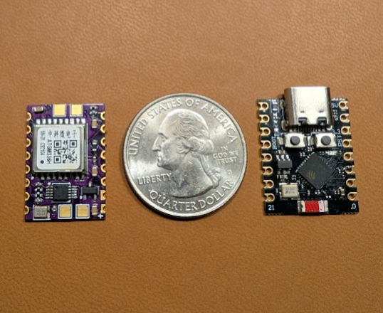
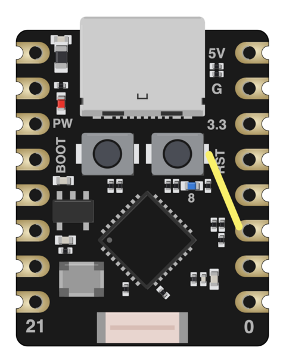
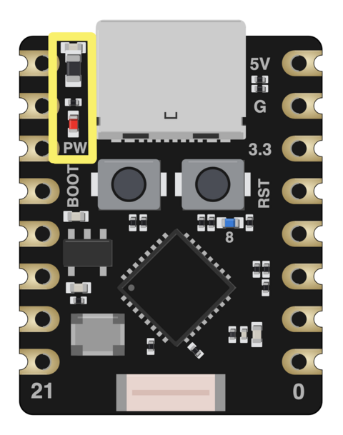
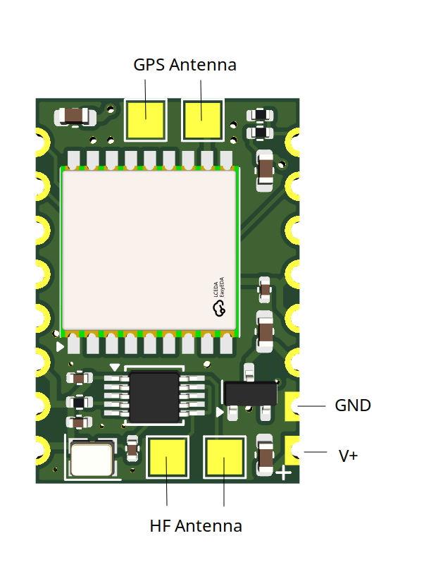

# Vagabond1 WSPR Transmitter

Vagabond1 is a tiny WSPR transmitter that piggybacks on the popular ESP32 C3
Super Mini board. It contains only 15 components (including 11 passives) and
can be assembled by hand. Vagabond1 is fully supported by
[Nomad](https://github.com/wsprtv/nomad) firmware.

## Links

- [Schematic](docs/vagabond1.pdf)
- [Interactive BOM](docs/ibom.html)
- [KiCad files](https://github.com/wsprtv/vagabond1/tree/main/kicad)
- [Gerbers](https://github.com/wsprtv/vagabond1/tree/main/gerbers)
- [Nomad firmware](https://github.com/wsprtv/nomad)
- [ESP32 C3 Super Mini Documentation](https://www.espboards.dev/esp32/esp32-c3-super-mini/)

## Assembly

In addition to the Si5351A or MS5351M clock generator and ATGM336H-5N31 GPS
module, Vagabond1 uses the
[TPV809R](https://www.digikey.com/en/products/detail/3peak/TPV809R-3TR/22228318)
voltage monitor and the
[HSB221S 26MHz TCXO](https://www.digikey.com/en/products/detail/harmony-electronics-corp-h-ele/TC2S026000DCCHE-T/16733095).
Both are readily available on DigiKey, though several pin-compatible
alternatives can be easily substituted.

Unpopulated PCBs can be ordered from [OSH Park](https://oshpark.com).
Upload the
[KiCad board file](kicad/vagabond1.kicad_pcb) and select the
**0.8mm thickness, 2oz copper** option. Stencils can be ordered from
[OSH Stencils](https://oshstencils.com) or cut at home using a Silhouette or
Cricut machine.

After applying solder paste and
placing the components, I reflow the boards on an electric skillet. Assembling
a batch of three boards takes roughly an hour.

When soldering Vagabond1 and ESP32 C3 Super Mini boards together, orient them
so that the GPS module **faces away** from the USB-C port.

## ESP32 C3 Super Mini Modifications

The ESP32 board requires two modifications when powered with solar panels.

1. The RESET line needs to be routed out to pin 2 to enable voltage
monitoring. Connect two pads with a wire as shown below:

2. Replacing the reverse polarity protection diode on VSYS with a 0-ohm
resistor or a solder bridge eliminates an unnecessary 0.2V drop. Removing
the always-on power LED or the associated current-limiting resistor
saves ~0.8 mA. The image below shows the location
of the diode (top highlighted component), followed by the resistor
and the LED. 

## Connections

